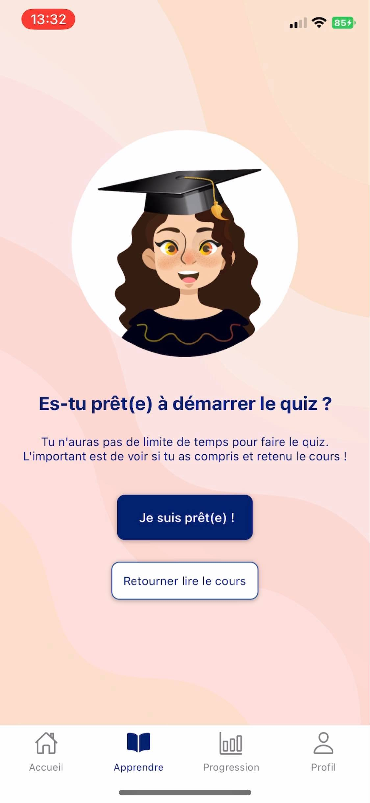

# CodeMind
> 
CodeMind est une application mobile cross-plateform (iOS and Android) permettant d'apprendre de manière ludique les bases de la programmation informatique.<br/> L'application propose des cours ainsi que des quiz pour permettre à l'utilisateur de vérifier ses connaissances.

Contenu
========

 * [Technologies](#technologies)
 * [Installation](#installation)
 * [Screens](#screens)

### Technologies
<hr>
Ce projet a été réalisé à l'aide des technologies suivantes : 
<ul> 
 <li>ReactNative</li>
 <li>Firebase</li>
</ul>

### Installation
<hr>
Pour installer et lancer ce projet, il vous faudra suivre les étapes suivantes : 
<br><br>


1. Cloner le repository :
  ```sh
  git clone https://github.com/Rbk98/PII-CodeMind.git
  ```
2. Ouvrir un terminal et installer expo :
  ```sh
  npm i -g expo-cli
  ```
3. Ouvrir un terminal, et installer les dépendances du projet :
  ```sh
  npm install
  ```
4. Télécharger l'application Expo Go sur votre smartphone
5. Exécuter la ligne suivante et scanner le QR Code sur votre smartphone :
  ```sh
  npm start
  ```

### Screens
<hr>
Voici des screens de l'application : 
<div align="center">
  
    
</div>
<div align="center">
  
  
  
</div>

